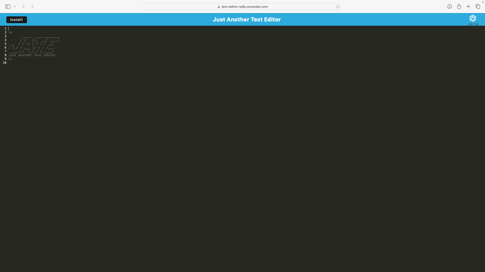

# Just Another Text Editor

## Description

Just Another Text Editor is a Progressive Web App (PWA) that works in your browser. It's a single-page application with built-in offline functionality and multiple data backup options for reliability.

## Table of Contents

- [Installation](#installation)
- [Usage](#usage)
- [License](#license)
- [Copyright](#copyright)

## Installation

[Deployed Application](https://text-editor-wi8y.onrender.com/)

## Usage

Just type to take notes.

## License

[MIT License](LICENSE)

- [GitHub Profile](https://github.com/mandeepiscoding)

## Copyright

© [2024] [Mandeep Singh]